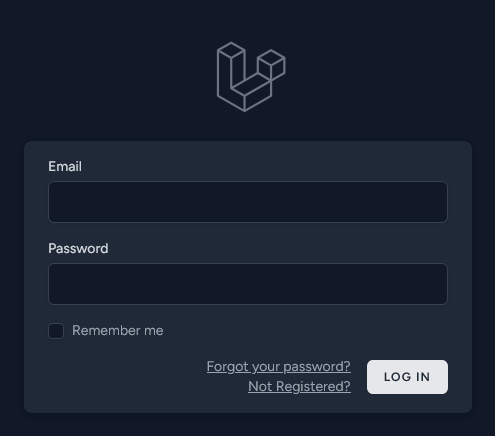
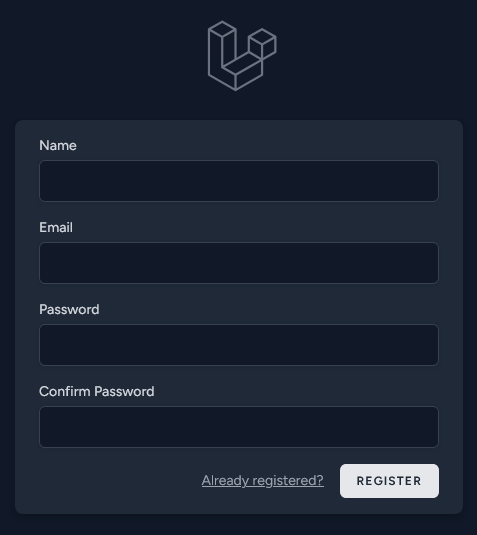
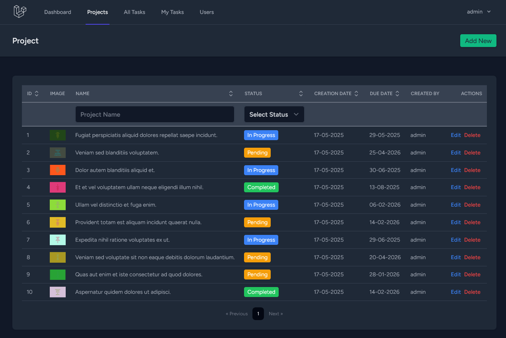
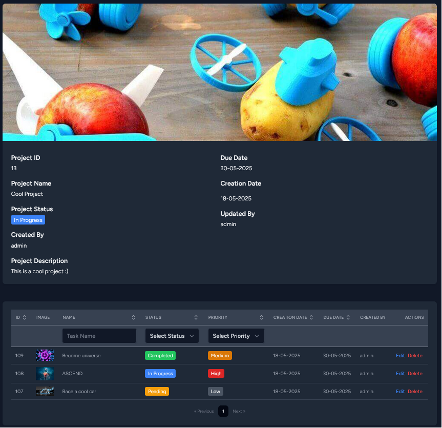
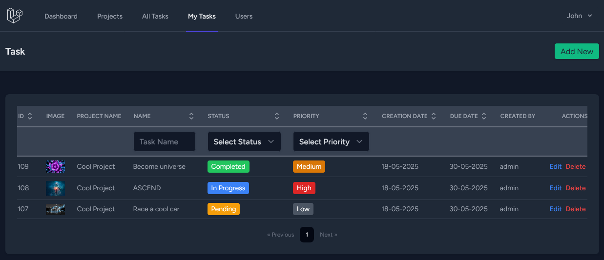
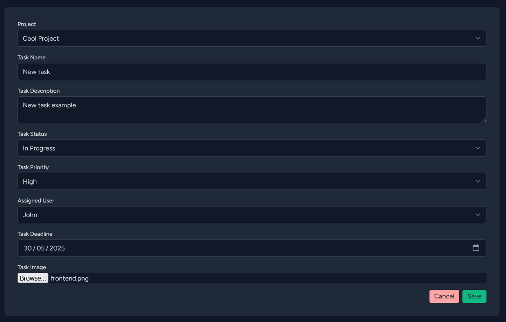
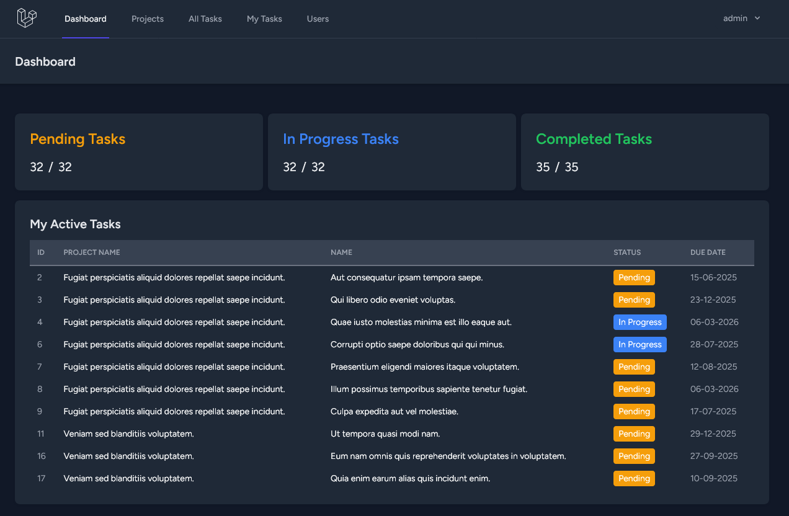

# Laravel + React Learning Project
---

A simple project management application built to learn Laravel (PHP), React, and Inertia.js.

## 💻 Tech Stack
---
**Frontend**  


**Backend**  


**Database**  


## ✨ Features
---
### 🔐 Authentication
- User registration & login
- Protected routes




### 📂 Projects Management
- Create/Edit/Delete projects
- Project list with pagination
- Sorting & filtering by:
  - Name
  - Completion Status




### ✅ Tasks System
- Nested task creation within projects
- Assign tasks to users
- Task filtering by:
  - Name
  - Completion status
  - Priority (High/Medium/Low)
- "My Tasks" view for assigned work




### 📊 Dashboard
- Overview statistics:
  - Total active projects
  - Completed tasks
  - Upcoming deadlines




## 🛠️ Installation
---
1. **Clone repository**
   ```bash
   git clone https://github.com/nllko/project-management.git
   cd project-management
2. **Install dependencies**
    ```bash
    composer install
    npm install
3. **Configure environment**
    ```bash
    cp .env.example .env
4. **Initialize database**
    ```bash
    php artisan migrate --seed
5. **Generate app key**
    ```bash
    php artisan key:generate
6. **Start development servers**
    ```bash
    php artisan serve
    npm run dev

Visit http://localhost:8000 in your browser.

## 🤝 Contributing
---
This is primarily a personal learning project, but suggestions are welcome through issues. Not actively seeking contributions at this time.